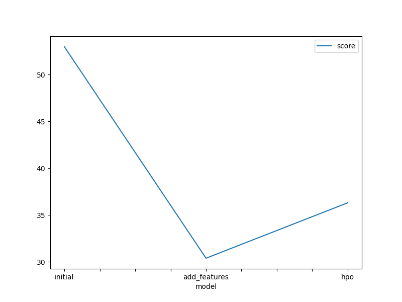
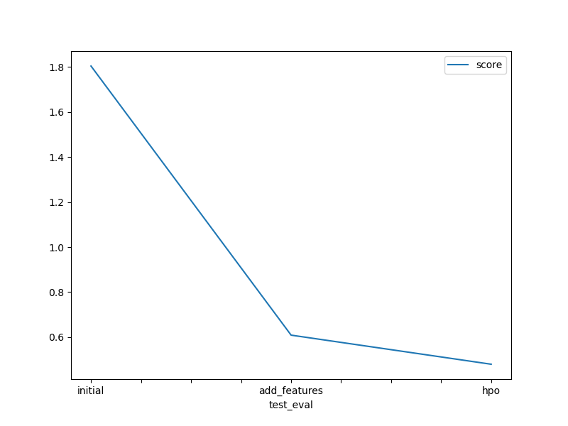

# Report: Predict Bike Sharing Demand with AutoGluon Solution
#### NAME HERE
Abdulrahman Hassan
## Initial Training
### What did you realize when you tried to submit your predictions? What changes were needed to the output of the predictor to submit your results?

I was asked to set any negative values to zero but there were no negative values but if there were any negative values as a result of the linear model predicting negtive values then ofcourse they will need to be set to zero because the zero does not make any since in the problem of predicting bike demand.
### What was the top ranked model that performed?

WeightedEnsemble_L3 with score val of -52.974635
## Exploratory data analysis and feature creation
### What did the exploratory analysis find and how did you add additional features?

The only features that i added were related to the daetime column but i belive that if i dug more into the data and understood more about the features I could've engineered more features.
### How much better did your model preform after adding additional features and why do you think that is?

it went from score of 1.80349 to 0.60925 on the private score on kaggle
## Hyper parameter tuning
### How much better did your model preform after trying different hyper parameters?

it went from score of 0.60925 to 0.48013 on the private score on kaggle
### If you were given more time with this dataset, where do you think you would spend more time?

I think I would have workered more on feature engineering and also hyperparameter optimization especially on model specific hpo.
### Create a table with the models you ran, the hyperparameters modified, and the kaggle score.
|model|hpo1|hpo2|hpo3|score|
|--|--|--|--|--|
|initial|None|None|None|1.80349
|add_features|None|None|None|0.60925|
|hpo|num_boost_round: 100|learning_rate: 0.05|n_estimators: 100|0.48013

### Create a line plot showing the top model score for the three (or more) training runs during the project.

### Create a line plot showing the top kaggle score for the three (or more) prediction submissions during the project.

## Summary
This project's main focus was to solve the bike sharing demand regression problem using the Autoglueon framework :
- First thing we trained the tabular model without any feature engneering and used the results as a base to detect if we are improving or not in the following steps.
- Secondly we added some new features to check if the model's error would decrease as it did. 
- Third and finally we optimized some hyperparameters and it proved to decrease the error again on the kaggle score.
  ### why certain changes to a hyperparameter affected the outcome of your score.
Hyperparameter tuning allows for optimizing model performance by finding the best combination of parameters that influence the learning process, this works well with the Autogluon framework as it uses a combination of different models and hyperparameters to find the best performing model for the given dataset.

but in my case, in the trainning phase the predictor did best with adding new features and not with hyperparameter tuning, I think this happened because when Autoglueon is training on the train data it measures the error on the train data itself and it could be that the model is overfitting to the train data and not generalizing well but with hyperparameter tuning the model was able to generalize better and thus perform better on the test data.